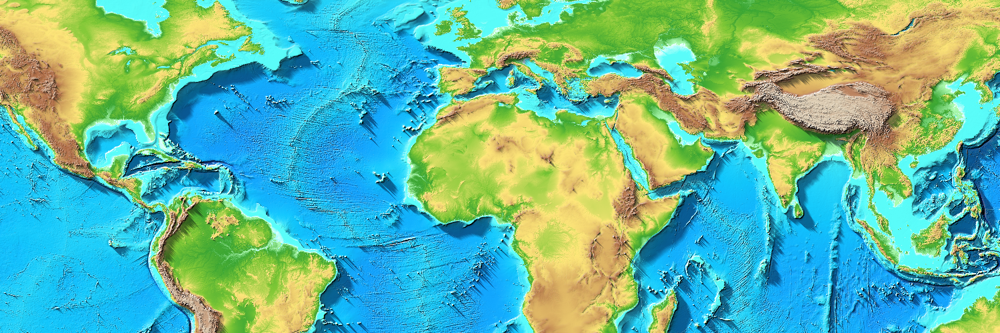

# TopoToImage User Guide

**Version 4.0.0-beta.3**



---

## Table of Contents

1. [Overview](#overview)
2. [Elevation Databases](#elevation-databases)
3. [Opening Databases](#opening-databases)
4. [Main Window Interface](#main-window-interface)
5. [Gradient Style Panel](#gradient-style-panel)
6. [Creating Visualizations](#creating-visualizations)
7. [Gradient Editor Window](#gradient-editor-window)

---

## Overview

### What TopoToImage Does

TopoToImage creates colored terrain visualization images from elevation databases. The application imports Digital Elevation Model (DEM) data, applies color gradients based on elevation, and renders professional cartographic output with hillshading and cast shadows.

### Import and Export Workflow

**Import:** Open elevation databases in GeoTIFF or BIL/DEM format (single-file or multi-file)

**Visualize:** Select geographic area, apply color gradients, configure shading and shadows

**Export:**
- **Images:** GeoTIFF, Geocart Image Databases, PNG, and JPG. Optionally save a metadata PDF file with imformation about the image
- **Elevation Databases:** Cropped and/or scaled versions of the source data

The elevation export feature allows you to create smaller, cropped, or reduced-resolution versions of large databases for faster testing or distribution.

---


## Elevation Databases

### What Are Elevation Databases?

Elevation databases are files containing height values for geographic locations. Each pixel in the database represents the elevation (in meters) at a specific latitude/longitude coordinate.

### Supported Formats

**GeoTIFF (.tif, .tiff)**
- Single file containing both elevation data and georeferencing
- 16-bit elevation values
- Industry standard format

**BIL/DEM (.bil, .dem)**
- Requires three files:
  - `.bil` or `.dem` - Elevation data
  - `.hdr` - Header file (dimensions, resolution)
  - `.prj` - Projection file (coordinate system)
- All three files must be present in the same directory

### Where to Get Data

For comprehensive information on elevation data sources, formats, and download instructions, see the **[Elevation Data Sources Guide](ELEVATION_DATA_SOURCES.md)**.

**Quick recommendations:**
- **Beginners:** Use included sample data in `assets/sample_data/`
- **Regional work:** SRTM (30m resolution, good quality)
- **Global projects:** GMTED2010 (modern, multiple resolutions)
- **Ocean mapping:** GEBCO 2025 (best ocean floor data, high resolution)

### Single-File vs Multi-File Databases

**Single-File Database**
- One GeoTIFF file or one BIL/DEM file set
- Covers a single geographic area
- Simple to open and use

**Multi-File Database**
- Multiple elevation files in a folder
- Each file (tile) covers adjacent geographic areas
- TopoToImage automatically stitches tiles together for seamless visualization
- Enables continent or world-scale mapping

---


## Opening Databases

### Opening Single-File Databases

**File → Open Database** (Cmd+O)

1. Navigate to your elevation file
2. Select a GeoTIFF file, or the `.tif`, `.bil`, or `.dem` file from a BIL/DEM set
3. Click Open

The world map displays the database coverage area as a green rectangle. The selected area within the database is shown as a light red box with a dark red outline.

### Opening Multi-File Databases

**File → Open Database** (Cmd+Shift+O)

1. Navigate to the folder containing multiple elevation files
2. Select the folder
3. If a `.json` metadata file exists, TopoToImage loads the multi-file database automatically
4. If no `.json` file exists, use "Create Multi-File Database" first (see below)

Blue lines show individual tile boundaries for multi-file databases.

### Creating Multi-File Databases

**File → Create Multi-File Database** (Cmd+Shift+N)

Use this command when you have multiple elevation tiles in a folder that should work together as one database.

**Requirements:**
- All files must be in the same folder
- Each file must be a valid GeoTIFF or BIL/DEM format
- Files can be in subfolders (each BIL/DEM set in its own subfolder is fine)
- No specific naming convention required - use original filenames from data source

**How It Works:**
1. Select the folder containing your elevation files
2. TopoToImage scans the folder and analyzes each file's:
   - Geographic boundaries (lat/lon coverage)
   - Resolution (pixels per degree)
   - Elevation range
3. A `.json` metadata file is created in the folder with the compiled database information
4. The database is now ready to open as a multi-file database

**Example folder structure:**
```
MyGlobalDatabase/
├── tile_n00e000/
│   ├── data.dem
│   ├── data.hdr
│   └── data.prj
├── tile_n00e010.tif
├── tile_n10e000.tif
└── MyGlobalDatabase.json  ← Created by TopoToImage
```

### Reveal Database in Finder

**File → Reveal Database in Finder** (Cmd+R)

Opens Finder and highlights the currently loaded database file or folder. Useful for quickly locating your data files on disk.

### Recent Databases

**File → Recent Databases**

Quick access to previously opened databases. Shows a list of recently used elevation databases for fast reopening without navigating the file system.

---


## Main Window Interface

### World Map

- Displays the boundary of the currently open database as a **green rectangle**
- A **red rectangle** displays the selected area (light red fill with dark red outline)
- If a multi-file database is open, **blue lines** show individual tile boundaries
- Click and drag within the green rectangle to change the selected area
- If the open database is not the full world, the selection is limited to within the database area
- If the open database spans the whole world from -180° to +180°, selections are allowed across the -180° or +180° boundary
  - Drag out a selection area across the boundary and the other half of the selection area will appear on the other side of the map
- **Keyboard shortcut:** Cmd+D to select the whole database

### Selection Coordinates

Displays the boundary of the selected area in either:
- **Decimal Degrees** format (e.g., 45.5°)
- **Degrees/Minutes/Seconds** format (e.g., 45°30'00")

### Database Info Panel

Shows information about the currently loaded elevation database:

- **Width/Height** - Database dimensions in pixels
- **Pixels per Degree** - Resolution of the data
- **Latitude/Longitude Boundaries** - Geographic coverage (N/S/E/W)
- **File Size** - Storage size of the database
- **Pixel Height** - Geographic distance (in miles or km) of one pixel's height

### Export File Info Panel

Shows information about the image/database that will be exported based on current selection:

- **Width/Height** - Output dimensions in pixels
- **Pixels per Degree** - Output resolution
- **File Size Estimate** - Approximate output file size
- **Pixel Height** - Geographic distance (in miles or km) of one pixel's height

This allows you to verify output size before exporting and adjust selection or scaling as needed.

### Export File Controls

This panel contains information that controls the scale of the exported image or database and, when relevant to the file type, the resolution of the exported image.

**Export Scale Spin Box**

Controls the resolution scaling of exported data. A convenient pop-up menu provides common scale values, or type a custom scale. When the export scale changes, the Export File Info panel updates to reflect the new output dimensions.

**Export Image Size Controls**

These controls function similarly to Photoshop's Image Size command:

- **Three edit fields:** Width, Height, and Resolution
- **Lock radio buttons:** Lock one field - as export scale or selected area changes, the locked field remains constant while the other two adjust proportionally
- **Unit radio buttons:** Choose units for the exported file
  - Inches
  - Picas
  - Points
  - Centimeters

**Note:** Resolution controls are relevant when exporting TIFF, JPEG or PNG image files. They determine the physical dimensions and print resolution of the exported image.

---


## Gradient Style Panel

### Preview Icons

**Purpose:** Small terrain preview thumbnails showing what the currently selected gradient looks like when applied to real elevation data.

**Cycling Through Previews:**
- Double-click the preview icon to cycle through available preview databases
- Shows same gradient on different terrain types
- Helps evaluate gradient effectiveness before applying to full database
- The status bar at the bottom left of the main window will show the name of the preview icon database and its sequence number within the full sequence of preview databases

**Preview Icon Menu Commands:**

**Create Preview Icon Database**
- Renders current map selection as a new preview database
- Useful for testing gradients on specific terrain in your project
- A square section at the center of the currently selected area will be scaled down to be 128 pixels wide and tall and saved as a new preview database

**Next Preview Icon**
- Cycles through the previews the same as double-clicking on the preview icon
- Keyboard shortcut: Cmd+Shift+Right Arrow

**Delete Preview Icon Database**
- Removes preview databases you no longer need
- First (default) preview cannot be deleted

### Gradient Management Buttons

Eight buttons control gradient creation, editing, and organization:

**New Gradient (Cmd+G)**
- Opens gradient editor window
- Creates copy of currently selected gradient
- Gradient name shows "_copy" suffix to indicate new gradient will be saved separately

**Edit Gradient (Cmd+E)**
- Opens gradient editor for currently selected gradient
- Changes affect the existing gradient

**Delete Gradient (Delete)**
- Removes currently selected gradient from list
- Cannot be undone

**Move Up / Move Down (Cmd+Up Arrow / Cmd+Down Arrow)**
- Rearranges gradient position in list

**Sort List (Cmd+L)**
- Sorts all gradients alphabetically by name

**Save List (Cmd+Shift+S)**
- Exports current gradient list to file

**Load List (Cmd+Shift+L)**
- Imports gradients from saved file
- A dialogue window will show these options:
  - **Append** - Adds loaded gradients to end of current list. If there are duplicate names, the duplicates will not be loaded. Only gradients with unique names will be loaded.
  - **Replace** - Replaces entire gradient list with loaded gradients

**Note:** Gradient menu also provides access to these commands.

### Gradient List

**Selection**
- Click gradient name to select
- Selected gradient is used for preview and export
- Preview icons update to show selected gradient

**Organization**
- Use Move Up/Down to manually arrange
- Use Sort List for alphabetical order
- Gradient order is saved with list

### Percent vs Meters Mode

Critical setting that controls how gradients are applied to elevation data.

**Percent Mode (Auto-Scaling)**
- Scans selected area for minimum and maximum elevation
- Scales gradient to fit between these values
- Lowest elevation = bottom gradient color
- Highest elevation = top gradient color
- After previewing or saving an image, the maximum and minimum elevations are recorded in the Maximum and Minimum spin boxes
- **Best for:** Areas with unknown elevation range, ensuring full gradient is always visible

**Meters Mode (Fixed Thresholds)**
- Gradient elevation values are explicitly set in meters
- Colors are applied at exact elevation thresholds
- Elevations below gradient minimum use bottom color
- Elevations above gradient maximum use top color
- **Best for:** Precise control, comparing multiple areas at same scale, bathymetric/topographic boundaries

**Example 1: Percent mode vs Meters mode**
- Gradient set to 0m (bottom) → 100m (top)
- Selected area contains mountains up to 2000m elevation
- **Percent mode:** 0m gets bottom color, 2000m gets top color, gradient scales across full range
- **Meters mode:** 0-100m shows gradient, everything above 100m shows top color

**Example 2: Discovering elevations in one area and using those elevations on subsequent maps**
- An area of the map is selected and the Preview button is clicked
- A window with the preview map is created and the gradient colors are fit between the maximum and minimum elevations found in the selected area
- The maximum and minimum elevations found in the selected area are recorded in the Maximum and Minimum spin boxes
- The user clicks the Meters radio button
- Selecting new areas on the map will now share the gradient range as the first map
- Maximum and minimum elevations in a selected area can be discovered and those same values can be used on new selected areas to make different maps with the same gradient range applied to each

### Save Legend File

If this radio button is checked when an image file is saved, a separate PDF file with the same name is saved containing metadata for the saved image. This metadata includes the width, height, pixels per degree for the selected area. It also contains information about the gradient elevations including the elevation of each color and its RGB values.

---


## Creating Visualizations

### Preview Button

- Renders current selection with current gradient settings
- Opens in separate window
- Pay attention to the export file info pixel width and height. These elevation databases can be quite large, so if a huge area is accidentally selected and the Preview button is clicked, it could take a very long time for the preview to generate a large image. Use the export scale spin box to reduce a large selected area to a manageable size.
- Note that this program has been designed to work with huge elevation databases. The program has successfully processed the full GEBCO database and reduced it to a manageable size to show the full world. However, this took many hours. Working with huge databases has not been fully tested.
- Does not save file - for evaluation only

### Save Image File Button

**Also available:** File → Save Image File (Cmd+S)

When this option is selected, a pop-up window will be available in the file requester window with the following options:

**Export Options:**
- **GeoTIFF** - Georeferenced image for GIS applications (QGIS, ArcGIS, etc.)
- **Geocart Image** - These images can be used with Geocart, professional mapping projection software, to reproject the images into any one of dozens or hundreds of available projections
- **PNG** - Standard image format, high quality
- **JPG** - Compressed image format, smaller file size
- **Multiple PNG Files** - Exports separate layers:
  - Gradient (base colors)
  - Hillshading
  - Shadows
  - Elevation data
  - Ideal for compositing in Photoshop, Illustrator, or other image editors

### Export Elevation Database Button

**Purpose:** Create cropped and/or scaled versions of source elevation data

**Format Options (in Save dialog):**
- **GeoTIFF** - Standard georeferenced format
- **DEM** - BIL format with header and projection files

---


## Gradient Editor Window

**Access:** Click "New Gradient" or "Edit Gradient" button

The gradient editor provides complete control over terrain visualization appearance.

### Gradient Types

There is a preview icon that shows the current gradient settings applied to the currently selected preview icon database. This icon is redrawn as changes are made to the gradient options.

Five visualization modes for different cartographic needs:

**1. Shaded Relief**
- Pure hillshading without color
- Grayscale representation of terrain
- Light and shadow based on surface angles

**2. Gradient**
- Color gradient based on elevation
- Up to 64 color stops can be added to the gradient
- Elevations between color stops are blended between the color stop above and below

**3. Posterized**
- Discrete elevation bands (stepped colors)
- Colors are not blended between color stops
- Each color stop defines the color at the stop's elevation and elevations down to the next lower stop
- For colors above the topmost color stop, the color of the "Above Posterized" color chip is used

**4. Shading and Gradient**
- Shaded relief is mixed with the Gradient image

**5. Shading and Posterized**
- Shaded relief is mixed with the Posterized image

### Shading and Shadow Options

If the Shaded Relief, Shading and Gradient, or Shading and Posterized options are selected, the shading and shadow options become active.

**Light Direction**
- The light direction controls determine the direction of the light and dark side of the hillshading
- The light direction can be set to any angle between 0° and 360°
- Note that this is not the true light direction from the sun. It's a decorative hillshading effect that reveals the terrains topography.

**Percent Shading Intensity**
- This controls the intensity of the hillshading
- This number can be set to any value. It is not limited to the 0 to 100% range

**Draw Cast Shadows**
- When this box is checked, the shadow options become available

**Drop Distance**
- This control determines the length of cast shadows. Lower numbers in this field create longer cast shadows
- The shadows are created by scanning across the elevation database in the direction of the light direction. Each elevation value is compared to the previous elevation value in the scan direction. If the previous elevation value minus the Drop distance is lower than or equal to the current pixel's elevation value, then the current pixel is not in shadow. If the previous elevation value minus the drop distance is higher than the current elevation, then the current pixel is in shadow. This shadow elevation is remembered and used for the next comparison in the scan direction. This continues in the scan direction, subtracting the drop distance on each iteration and recording shadow elevation, until the shadow distance becomes lower than the current pixel's elevation. Once the shadow elevation is lower than the current elevation, the pixel is no longer in shadow.

**Shadow Soft Edge Size**
- When the height of the shadow above the current elevation is less than this value, then the color of the shadow is reduced in proportion to the distance of the shadow from the elevation divided by this value

**Shadow Color**
- This color chip represents the color of the shadow. This color is multiplied over the shading or gradient colors
- Click on this color chip to get a color selector to change the shadow color

### Gradient Options

**Number of Colors**
- Enter the number of color points on the gradient bar. Values can range from 2 to 64
- Use the spin box up and down controls to add or remove points
- Added points will appear midway between the topmost point and the point below
- Removed points will be deleted from the top of the gradient bar

**Maximum and Minimum Elevation**
- These two spin box edit fields control the elevation of the top and bottom of the gradient bar
- There are two options for the units:
  - Clicking the **Percent** radio button makes the gradient bar stretch between the maximum and minimum elevation in a selected area of the map. When images of this type are created, the selected area of the map is scanned to find the maximum and minimum elevation. Then the gradient is stretched to fit between these two elevation values
  - Clicking the **Meters** radio button sets the gradient type to use the maximum and minimum elevation specified in the edit fields above

**Interactive Gradient Bar**
- The gradient bar represents colors as they will be applied to elevations found in the selected area of the currently open database between the maximum elevation and the minimum elevation
- Color points and their elevation are represented by small circles pointing to the gradient bar
- There is one currently selected point which is a larger circle
- The elevation of the current point can be changed by dragging the current point up or down on the gradient bar
- The elevation of the current point can also be changed by adjusting the number in the point elevation spin box edit field
- Clicking on one of the small circles will make it the currently selected point
- The currently selected point can also be changed by changing the number in the point number spin box edit field. The numbers are generally numbered from one at the bottom up to the maximum number of colors
- The color of the currently selected point can be changed either by double-clicking on the selected point circle or by clicking the selected point color chip
- Clicking directly on the color bar adds a new color point
- To remove a point, drag it by 100 pixels to the left or the right of the gradient bar. The point will be deleted

**No Data Color**
- Pixels in the elevation database that are marked as having no data will be colored with this color. Many databases that just have data for land have ocean values set to no data. In that case, this color can be used to color the oceans

**Above Posterized Color**
- The Posterized gradient type and the Shading and Posterized gradient type use this additional color. This color is applied to all pixels that have an elevation higher than the color point at the top of the gradient bar

### Elevation Effects Buttons

**Spread Button**
- This button spreads the points on the color bar evenly between the top of the color bar and the bottom of the color bar

**Square Button**
- The effect of this button is to compress the elevation of points towards the bottom of the gradient bar. This can be useful because elevation databases tend to have many more pixels at lower elevations than higher elevations. So compressing the color stops towards the bottom can add more color variation to lower elevations

**Flip Button**
- This button causes the color points and their elevation to be flipped on the gradient bar

### Color Effects Buttons

**Random**
- A random color is generated for each color point

**Rainbow**
- The colors of the points are changed to sequential RGB values corresponding to a 360° circle around the color wheel divided by the number of points

**Roll**
- Each point on the gradient bar takes on the color of the point above it. The topmost point takes on the color of the bottom point

**HLS**
- Opens a window where the hue, lightness, and saturation of the colors can be adjusted. There is an option to adjust all colors or just the current point

---

## Tips and Workflow

**Starting a New Project:**
1. Open elevation database (single or multi-file)
2. Select geographic area on map
3. Choose gradient from list (or create new)
4. Set Percent/Meters mode
5. Preview to test appearance
6. Adjust gradient, shading, shadows as needed
7. Export image or elevation database

**Testing Gradients:**
- Use preview icons to see gradient on different terrain
- Create preview from your project area for accurate evaluation
- Cycle through previews while adjusting colors

**Managing Large Databases:**
- Create multi-file database from downloaded tiles
- Export smaller regional databases for faster testing
- Use lower resolution for draft visualizations
- Export full resolution for final output

**Organizing Gradients:**
- Save gradient lists by project or theme
- Use descriptive names (e.g., "Alps_Hypsometric", "Ocean_Bathymetry")
- Sort alphabetically for large collections
- Delete unused gradients to reduce clutter

---

**For installation instructions, see [INSTALLATION.md](INSTALLATION.md)**

**For technical details on bundle creation, see [COMPLETE_BUNDLE_CREATION_GUIDE.md](COMPLETE_BUNDLE_CREATION_GUIDE.md)**

**Report issues at:** https://github.com/jlert/TopoToImage/issues

---


---
